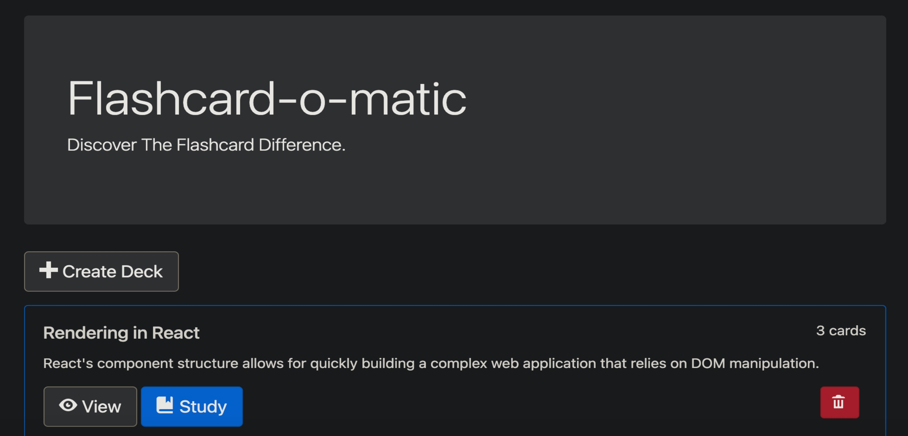

## Project description: Flashcard-o-matic
A local school has decided to put together a flash card application, Flashcard-o-matic, to help their students study online. 

Teachers will use this application to create decks of flash cards for the subjects that they teach, and students will study the decks. 

### This Project is built in _ReactJS_ : 

React makes it possible to quickly build a complex web application that uses data from an external API and keeps the URL in sync with what is displayed on the screen.

### The knowledge applied to build this project:
rendering, managing state, calling external APIs, and using React Router.
### What this app do Technically :
- Uses API to create, read, update, and delete records stored by the API.
- Manages the state of the React application.
- Defines the routes and URLs.
- Uses state effectively over multiple components.
